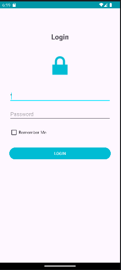
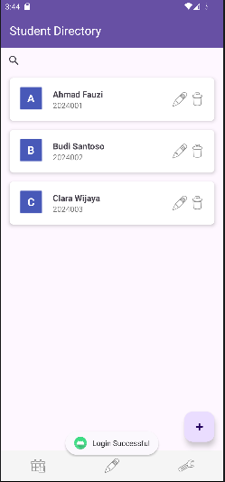
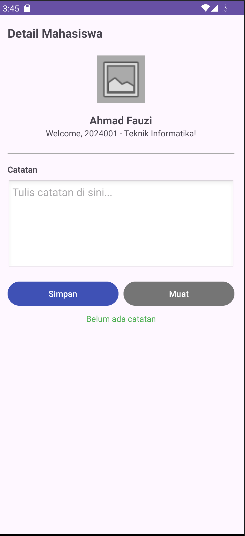
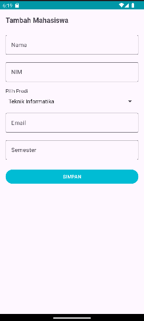

# StudentContactApp

**NAMA:** R. Rafi Yudi Pramana  
**NIM:** F1D02310132

## Deskripsi Singkat Aplikasi
StudentContactApp adalah aplikasi manajemen data mahasiswa yang dirancang untuk membantu pengelolaan informasi kontak dan catatan akademik. Aplikasi ini memiliki fitur autentikasi, daftar direktori mahasiswa dengan pencarian real-time, formulir penambahan dan pembaruan data mahasiswa (CRUD), serta pengelolaan catatan pribadi untuk setiap mahasiswa.

## Screenshots
Berikut adalah tampilan utama dari aplikasi StudentContactApp:

### 1. Halaman Login

### 2. Halaman Daftar Mahasiswa (Home)

### 3. Halaman Detail Mahasiswa & Catatan

### 4. Halaman Form Tambah/Edit Mahasiswa

## Metode Penyimpanan yang Digunakan
Dalam pengembangan aplikasi ini, tiga metode penyimpanan Android digunakan sesuai dengan fungsinya:

1. **SharedPreferences**: Digunakan untuk menyimpan status login (*isLoggedIn*, *username*), fitur *Remember Me*, dan pengaturan aplikasi seperti *Dark Mode* dan notifikasi. Dipilih karena sangat efisien untuk menyimpan data sederhana berupa pasangan kunci-nilai (key-value).
2. **Internal Storage**: Digunakan untuk menyimpan catatan teks spesifik per mahasiswa dalam bentuk file `.txt`. Metode ini dipilih karena catatan dapat memiliki panjang yang bervariasi dan bersifat privat bagi aplikasi, sehingga aman disimpan di direktori internal.
3. **Room Database**: Digunakan sebagai repositori utama untuk data terstruktur mahasiswa (Nama, NIM, Prodi, dll). Room menyediakan lapisan abstraksi di atas SQLite yang memudahkan operasi CRUD (Create, Read, Update, Delete) dengan keamanan tipe data dan dukungan asinkronus menggunakan Coroutines.

## Kendala yang Dihadapi dan Cara Mengatasinya
1. **Konfigurasi Gradle & Plugin KAPT**: Terdapat ketidakcocokan antara versi Gradle (9.3.1) dengan plugin Room/KAPT yang menyebabkan sinkronisasi gagal.  
   *Solusi*: Melakukan *downgrade* versi Gradle ke 8.7 dan menyesuaikan versi Android Gradle Plugin (AGP) ke 8.3.2 agar kompatibel dengan library Room yang digunakan.
2. **Error Resource Linking**: Muncul error "attribute android:gap not found" saat mencoba memberikan jarak antar elemen dalam LinearLayout.  
   *Solusi*: Mengganti atribut non-standar tersebut dengan penggunaan `android:layout_margin` atau `padding` pada elemen terkait sesuai dengan dokumentasi resmi Android.
3. **Integrasi SharedPreferences & Room**: Kesulitan saat sinkronisasi status login di `MainActivity`.  
   *Solusi*: Menggunakan `PrefManager` untuk melakukan pengecekan status login di `onCreate` sebelum memuat data dari Room Database, serta menambahkan fungsi `onResume` untuk me-refresh data secara otomatis setelah proses *Edit*.
